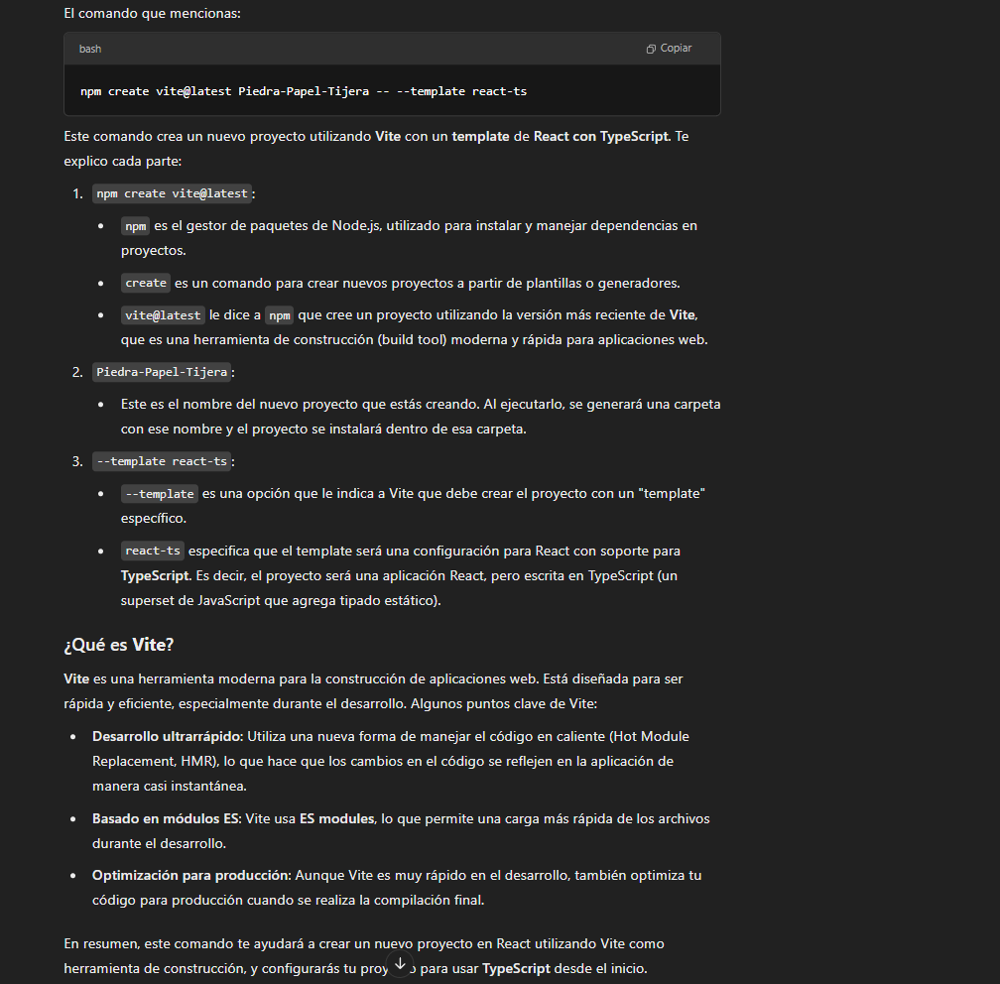
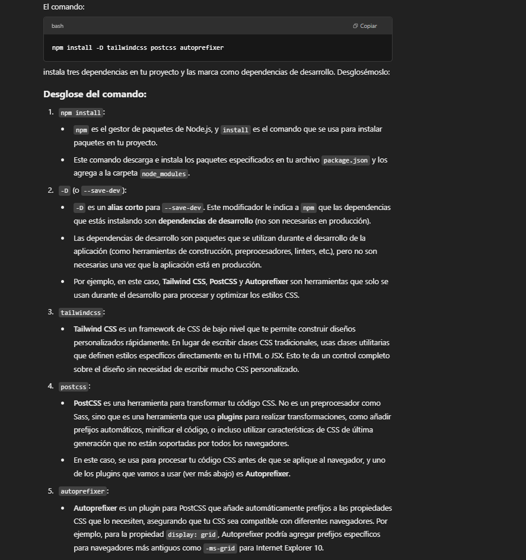
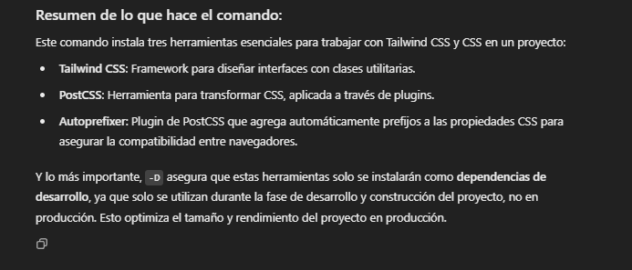
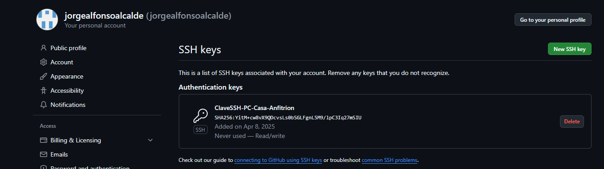

# Comandos usados proyecto React: Piedra-Papel-Tijera
## Creación del proyecto
1.  "npm create vite@latest Piedra-Papel-Tijera -- --template react-ts": para crear el proyecto React mediante Vite, usando plantilla react-ts de Vite.
   

**Ahora, situado en la raíz del proyecto:**
2. "npm install -D tailwindcss@3.4.1 postcss autoprefixer": Instala dependencias necesarias para el funcionamiento de tailwind.
    
    

3. "npx tailwindcss init -p"

## Instalación y configuración de Git
1. Descargo e instalo Git con el instalador .exe de la web oficial.
2. Una vez instalado configuro nombre de usuario y correo desde terminal:
   1. **git config --global user.name "JorgeAlfonso".**
   2. **git config --global user.email "jorge.alfonso@avocoding.com"**
3. Genero claves ssh: **'ssh-keygen -t ed25519 -C "tu_correo@ejemplo.com"'**.
4. Copio la clave pública ("c/Users/jorge/.ssh/id_ed25519.pub") en github:
    
5. Compruebo que git funciona en mi pc con "ssh -T git@github.com" y dando "yes" recibo respuesta.
6. Enlazo el repositorio local con el remoto(el de github con "git remote add origin git@github.com:jorgealfonsoalcalde/piedra-papel-tijera.git").
7. Inicio git y gitglow con "git init" y "git flow init"